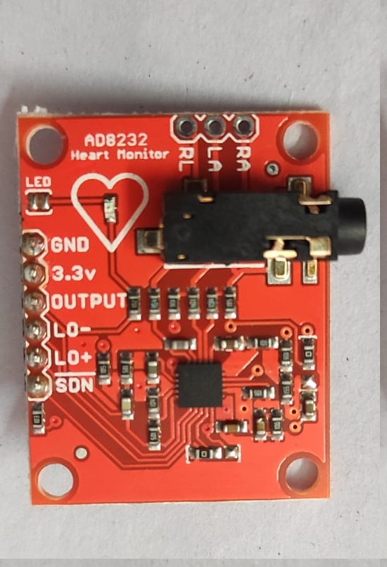
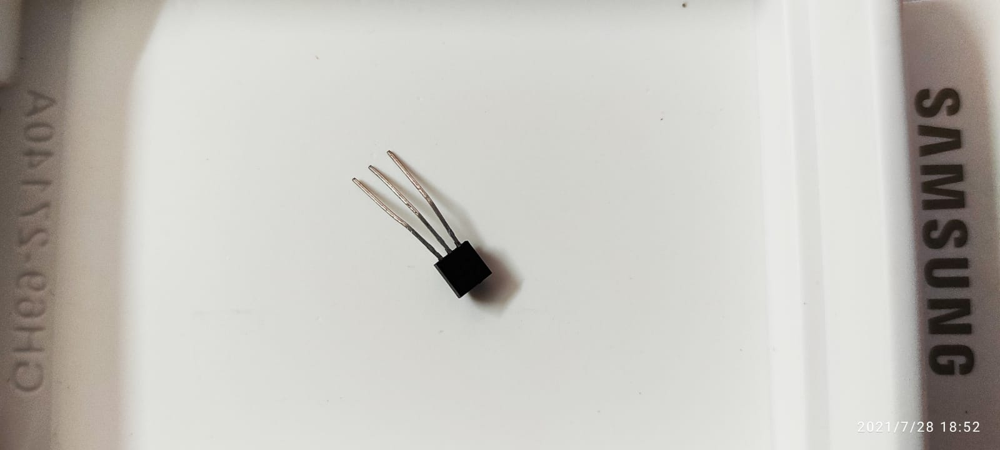
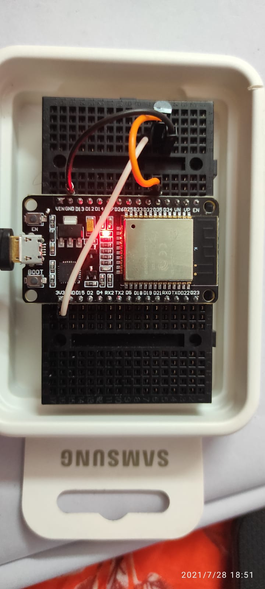
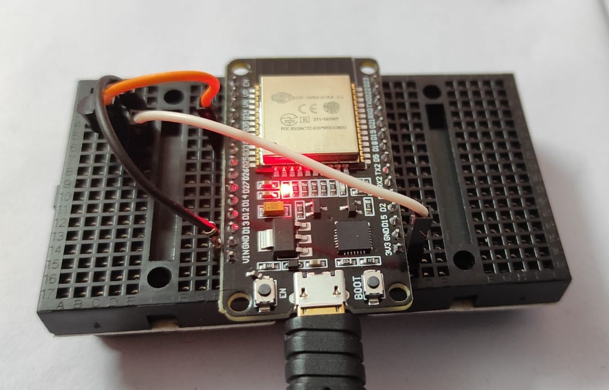
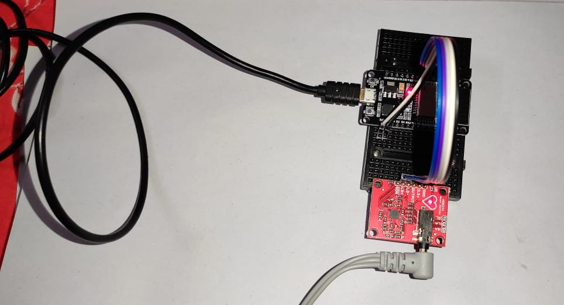
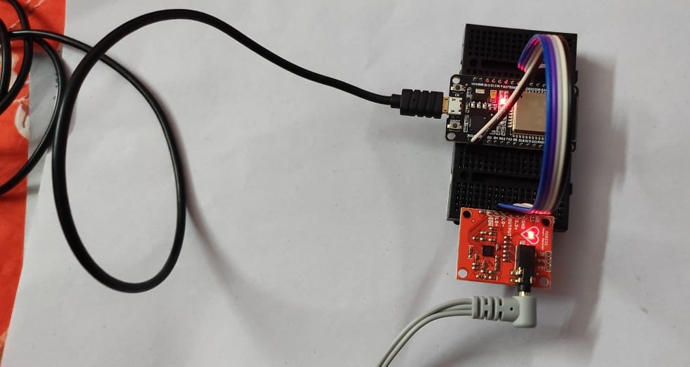

# Human-Biometric-Monitoring-System-using-ESP32-NodeMCU
A biometric system built using NodeMCU - ESP32 to monitor the body temperature and the pulse rate using LM35 Temperature Sensor and AD8232 ECG Heart Tracker. The data is logged into the Blynk IoT Cloud Platform.

### 1. AD 8232 ECG Tracker

     
   The Sensor which we have used for accurately predicting the heart beat rate by attaching it to the chest portion near the heart for getting the best recordings.
     
### 2. LM 35 Temperature Sensor

     
   The Sensor which we have used for accurately recording the tempearture of the body.
   
### 3. NodeMCU-ESP32 Single-board Microcontroller

     

     
   NodeMCU is a low-cost open source IoT platform. It initially included firmware which runs on the ESP8266 Wi-Fi SoC from Espressif Systems, and hardware which was based on the ESP-12 module. Later, support for the ESP32 32-bit MCU was added. We have used the NodeMCU version 1.0 which uses ESP-12E support. 
   
## The Setup

     
   The SetUp of NodeMCU-ESP32 with our AD8232-ECG Tracker and subsequent connection through USB Cable to the Laptop for code uploading to the firmware for performing the detection of Heart Beat
   
## The Setup Enhanced

